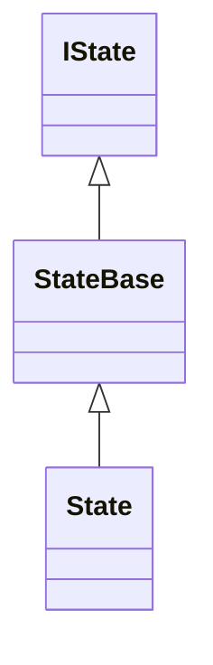

# RSP02Framework

## これはなに？

人工衛星に限らず、組み込みソフトウェアには定型的な処理方法や考え方がある。
たとえば、状態遷移については統一的で汎用的な考え方が知られているが、それをアプリケーション層エンジニアが毎回コーディングするのは、DRY原則違反というだけでなく、FSMの仕組みまで知ったうえでそれを正確にコーディングすることを要求することになり、難易度が跳ね上がる。

この問題を、状態遷移のアルゴリズムは定型処理としてフレームワークが提供し、アプリケーション層エンジニアはこの定型処理を知らなくても実装できる環境構築を目指す。
以下の処理について、定型的な枠組み（フレームワーク）の提供を目的とする。

* コマンド解釈
* 状態遷移
* ログシステム
* 時間取得機構
### コマンド解釈
### 状態遷移
各状態は、IState<T>インターフェースを通じて操作される。各状態は、Enter処理、Execute処理、Exit処理をそれぞれ具象クラスでオーバーライドすることで記述される。これらの処理は、GOFのデザインパターンのひとつであるStrategyパターンで記述され、3つの処理の適切な呼び分け、付随する状態の監理などは、基底classであるStateBase<T>が処理する。
IState<T> -> StateBase<T> -> ConcreteStateの継承関係を持つ。
(Tは、状態IDとしてenum classが渡されることを期待している)

StateMachine classは、これらのConcreteStateを適切に切替ながら実行する。状態の切替のためには、StateIDから対応するConcreteStateを選択するためのStateFactory<T>を利用している。
STLを使用していないため、状態IDからクラスインスタンスの逆引きは線形探索を行っているが、状態数はそれほど大きくならないことが期待できるため、現バージョンでは、この実装を採用している。
将来的には、STLコンテナであるunorderd_map(ハッシュによる連想配列)の採用を検討している。

### ログシステム
ログシステムは、フレームワーク内での定型的なイベント(状態遷移時、Enter,Execute,Exit処理時など)のフレームワーク外への通知に使用しているが、アプリケーション層エンジニアも利用可能な実装となっている。

また、それぞれのエンジニアがそれぞれのログを出力することは、ログの可読性の低下を引き起こし、ログの有用性を毀損するため、原則的にフレームワークのログシステムを使用することを要請する。

### 時間取得機構
組み込み環境では、時間の取得方法がハードウェア環境によって大きく異なる。一般的なRTOSでは、ひとつ以上のtickで時間を管理するが、どの程度まで抽象化されているかは、処理系及びRTOSの仕様に左右される。
本実装では、敢てRSP02 Framework内でTimeProviderを定義し、TimeProviderを差し替えられるようにした。
テスト実装では、clock()をmsec単位に変換して返す簡易実装を提供しているが、実環境ではなんらかのtickをmsec単位で返すようにTimeProviderを差し替えて対応する。
また、簡易的な経過時間計測classとして、TStopWatchを提供している。

## 実装方針

これらのフレームワークを提供するにあたり、ターゲットは比較的非力な部類とされるSTM32L476RGであることと、mbed-osのサポート言語がC++であることから、以下の制限内での実装を行う。

1. mbed-cliが要求する処理系がgcc6であることから、CはC11,C++はC++17(gcc6がサポートする範囲内)に準拠する
1. mbed-osはRTOSをサポートするが、RTOSの学習コストを鑑みてシングルスレッドを前提とする
1. 実行モデル?は、所謂メインループによる一筆書き
1. boostなどの非標準環境は使用しない
1. メモリの断片化による予期しないエラーの可能性を排除するために、素のnew/deleteは使用禁止(placement newについてはこの限りではない)
1. 原則的にSTLの使用は禁止するが、以下の限定的な使用は許容する
	1. boot後の初期化時
 	1. メモリ断片化の怖れのないカスタムアロケータを提供できる場合
 	1. 内部で動的メモリ確保されないことが保証されている場合(c.f. std::functionでキャプチャするオブジェクトサイズが小さいもの)

※現バージョンではSTLは一切使用していない。今後オブジェクトサイズなどを考慮しながら採用していく可能性は残しておく

# ディレクトリ構造
```
.
├── fw
│   ├── command
│   │   ├── CommandImplBase.hpp
│   │   ├── CommandTypeBase.hpp
│   │   ├── ExecutionStrategy.hpp
│   │   └── ICommand.hpp
│   ├── fsm
│   │   ├── StateBase.cpp
│   │   ├── StateBase.hpp
│   │   ├── StateFactory.hpp
│   │   └── StateMachine.hpp
│   ├── logger
│   │   ├── FifoSink.cpp
│   │   ├── FifoSink.hpp
│   │   ├── FileSink.cpp
│   │   ├── FileSink.hpp
│   │   ├── ILogger.hpp
│   │   ├── ISink.hpp
│   │   ├── Logger.cpp
│   │   ├── Logger.hpp
│   │   ├── NullSink.hpp
│   │   ├── PrintfSink.cpp
│   │   └── PrintfSink.hpp
│   ├── time
│   │   ├── StopWatch.cpp
│   │   ├── StopWatch.hpp
│   │   ├── time.hpp
│   │   ├── TimeProvider.cpp
│   │   └── TimeProvider.hpp
│   └── util
│       ├── align.cpp
│       ├── align.hpp
│       ├── assert.hpp
│       ├── callback.hpp
│       ├── pseudo_mbed.h
│       ├── queue.hpp
│       ├── raii.hpp
│       ├── singleton.hpp
│       └── thread.hpp
├── middle
│   ├── con_pro
│   │   ├── Consumer.hpp
│   │   ├── Executer.hpp
│   │   ├── IProcess.hpp
│   │   ├── Process.hpp
│   │   └── Producer.hpp
│   ├── debug
│   │   ├── DebugPort.cpp
│   │   ├── DebugPort.hpp
│   │   ├── IShell.hpp
│   │   ├── IShellCommand.hpp
│   │   ├── Shell.cpp
│   │   ├── Shell.hpp
│   │   └── stdinout.cpp
│   └── SystemManager.hpp
├── ntshell
│   ├── core
│   │   ├── ntconf.h
│   │   ├── ntint.h
│   │   ├── ntlibc.c
│   │   ├── ntlibc.h
│   │   ├── ntshell.c
│   │   ├── ntshell.h
│   │   ├── text_editor.c
│   │   ├── text_editor.h
│   │   ├── text_history.c
│   │   ├── text_history.h
│   │   ├── vtrecv.c
│   │   ├── vtrecv.h
│   │   ├── vtsend.c
│   │   └── vtsend.h
│   └── util
│       ├── ntopt.c
│       ├── ntopt.h
│       ├── ntstdio.c
│       └── ntstdio.h
├── src
│   ├── command
│   │   ├── CommandRoot.cpp
│   │   ├── CommandRoot.hpp
│   │   ├── RequestPingCommand.cpp
│   │   ├── RequestPingCommand.hpp
│   │   ├── RequestTakePhotoCommand.cpp
│   │   └── RequestTakePhotoCommand.hpp
│   ├── debug_command
│   │   ├── chloglv.cpp
│   │   ├── chloglv.hpp
│   │   ├── DBGCommandRoot.cpp
│   │   ├── DBGCommandRoot.hpp
│   │   ├── tlvcmd.cpp
│   │   ├── tlvcmd.hpp
│   │   ├── trigger.cpp
│   │   └── trigger.hpp
│   ├── process
│   │   ├── CommandKernel.hpp
│   │   ├── MessageConverter.hpp
│   │   ├── MessageDispatcher.hpp
│   │   ├── MessageInjecter.hpp
│   │   ├── ProcessRoot.cpp
│   │   ├── ProcessRoot.hpp
│   │   ├── StateMachine.hpp
│   │   ├── TLVDatalink.hpp
│   │   └── TLVStub.hpp
│   ├── states
│   │   ├── InitialState
│   │   │   ├── InitialFSM.cpp
│   │   │   ├── InitialFSM.hpp
│   │   │   ├── InitialState1.hpp
│   │   │   ├── InitialState2.hpp
│   │   │   └── InitialStateIdle.hpp
│   │   ├── MainState
│   │   │   ├── MainFSM.cpp
│   │   │   ├── MainFSM.hpp
│   │   │   ├── State1.hpp
│   │   │   ├── State2.hpp
│   │   │   └── StateIdle.hpp
│   │   └── StateCallbacks.cpp
│   ├── TLV_library
│   │   ├── rsp02_cdh.hpp
│   │   ├── rsp02_mission.hpp
│   │   └── rsp02.hpp
│   ├── GlobalDefine.hpp
│   ├── LogSystem.cpp
│   ├── LogSystem.hpp
│   └── main.cpp
├── .gitignore
├── FifoSink
├── FifoSinkStart.sh
├── makefile
└── README.md
```
src以下のコードは、OS02の基本動作デモと実装方法を示すためのテストコードのため、実際のアプリケーションコード開発時には、参考にしつつ改変、削除をしていく。

## 実装が必要なソースコード
### TLV_library/rsp02_*.hpp
これらのコードは、TLVコマンドを統一的に扱うためのクラス定義を与えている。

自系においてのコマンドタイプの定義で、それぞれの系で独立に用意する必要がある。
コードベースでは、rsp02_cdh.hppとrsp02_mission.hppを提供しているが、それぞれ不完全であることと、実際には自系のファイルだけがあれば良い。（C&DH系ならば、rsp02_cdh.hppだけで良い）
#### 定義詳細
___
自系におけるTLVコマンドのタイプを抽象化するための列挙型
```
enum class EType : uint8_t
```
TLVパケットのデータ構造におけるTYPEフィールドの長さを規定するため、サイズ指定には、パケットフォーマットに適合する型を指定しなければならない。

RSP02では、TYPEフィールドは1byteのため、uint8_tを指定しておけば良い。
___
自系でのTLVパケットを表す型のエイリアス
```
using TLVPacket = TLVpacket_t<EDestination, EType>
```
型の指定の簡便化のためのエイリアス定義。
___
enum型から文字列を生成するためのヘルパ関数（主にデバッグ、ログ出力用）
```
static inline const char* TypeString(EType dst)
```
動的メモリ割り当てをせずにenumから文字列を生成することが困難なため、素朴な実装を提供している。

EType型の値から、適切な文字列を返すように実装する必要がある。
___
TLVPacket用の整形出力ヘルパ関数（主にデバッグ、ログ出力用）
```
inline void TLVpacket_t<EDestination,EType>::print(char* buf)
```
TLVパケットを整形して文字列バッファに書き出す。整形済文字列が気に入らない限り、変更の必要はない。
___
### GlobalDefine.hpp
OS02の汎用クラステンプレートを自系用の定義でエイリアスしている。前述のTLV_library内のヘッダを適切に記述していれば、変更の必要はない。

#### 定義詳細
___
TLVコマンドのインターフェース
```
using ICommand = rsp::rsp02::fw::command::ICommand<TLVPacket>;
```
___
TLVコマンドの基底クラス
```
template<typename CMD_T, typename RES_T>
using CommandImplBase =rsp::rsp02::fw::command::CommandImplBase<CMD_T,RES_T,TLVPacket>;
```
___
Stateを表す列挙型(廃止の予定)
```
enum class StateID : int
```
___

### LogSystem.cpp
ログシステムの設定とインスタンス化をしている。テストコードでは、ログシステムのシンクとしてfifo_sinkを指定してインスタンス化しているが、実環境ではPrintfSinkなどに差し替える必要がある。

当面は、修正不要

### main.cpp
ファームウェアのエントリポイントだが、起動時のログメッセージや初期ログレベルを修正する場合以外には、修正不要。

### states/StateRoot.hpp , StateRoot.cpp
有限要素機械(FSM)のインスタンス保持と初期化のためのクラスであり、FSM、状態の追加/削除に応じて修正する必要がある。
___
クラスTStateRootに、アプリケーション内で動作させるFSMをすべてメンバ変数として保持するように実装しなければならない。テストコードでは、TMainFSMとTInitialFSMを保持している。
```
class TStateRoot
{
	public:
		TMainFSM MainFSM;
		TInitialFSM InitialFSM;

		// ここに必要なFSMを実装する
		
		TStateRoot();
		void Initialize();
};
```
___
```
TStateRoot::Initialize()は、保持するFSMのInitializeを呼ぶように実装しなければならない。その他、必要に応じて初期化処理をここに実装しても良い。
void TStateRoot::Initialize()
{
	MainFSM.Initialize();
	InitialFSM.Initialize();

	// ここに、保持しているFSMのInitialize()を呼ぶ記述を実装する
	// それ以外に、必要な初期化処理があれば、ここに書く
}
```
### processes/ProcessRoot.hpp , ProcessRoot.cpp
プロセスの保持と初期化のためのクラスであり、プロセスに応じて修正する必要がある。
___
クラスTProcessRootに、アプリケーション内で動作させるプロセスをすべてメンバ変数として保持するように実装しなければならない。
```
class TProcessRoot
{
	public:
		using TDSTDispatcher = rsp::rsp02::system::TMessageDispatcher<rsp02TLV,rsp02TLV,rsp02TLV::dst_t>;
		using TPRDispatcher = rsp::rsp02::system::TMessageDispatcher<rsp02TLV,rsp02TLV,int>;
		TinyTLV tlv;
		rsp::rsp02::system::TLVDatalinkUp<rsp02TLV> datalink_up;
		rsp::rsp02::system::TLVDatalinkDown<rsp02TLV> datalink_down;
		rsp::rsp02::system::DebugPort debugport;
		TDSTDispatcher DSTDispatcher;
		TPRDispatcher PRDispatcher;
		rsp::rsp02::system::TMessageConverter<rsp02TLV,TLVPacket> UpConverter;
		rsp::rsp02::system::TMessageConverter<TLVPacket,rsp02TLV> DnConverter;

		// ここに、必要なプロセスを保持するように実装する

		rsp::rsp02::system::TSystemManager<TLVPacket> SystemManager;

		TProcessRoot();

		void Initialize();
};
```
___
TProcessRoot::Initialize()は、プロセスの初期化及び、プロセス間の接続関係を記述する。

SystemManager.RegisterProcessで、プロセスを登録し、*.SetConsumerでデータの送り先を設定する。RegisterProcessで登録しただけではデータを出力しないため、動作しないことに注意する。
___
### debug_command/DBGCommandRoot.hpp , DBGCommandRoot.cpp
___
クラスTDBGCommandRootは、デバッグコマンド（NTSHELLのシェルコマンドの実体）の保持と初期化のクラスであり、デバッグコマンドに応じて修正する必要がある。
```
class TDBGCommandRoot
{
	public:
		tlvcmd tlv_cmd;
		chloglv chloglv_cmd;
		trigger trigger_cmd;
		rsp::rsp02::system::Shell shell;
		rsp::rsp02::system::DebugPort DebugPort;

		// ここにデバッグコマンドを保持するように実装する

		TDBGCommandRoot();

		void Initialize();
};
```
___
TDBGCommandRoot::Initialize()には、デバッグコマンドの初期化を記述する。
```
void TDBGCommandRoot::Initialize()
{
	shell.RegisterCommand( "tlvcmd", &tlv_cmd);
	shell.RegisterCommand( "chloglv", &chloglv_cmd);
	shell.RegisterCommand( "trigger", &trigger_cmd);
	trigger_cmd.RegisterState( &StateRoot.MainFSM.st2);

	// ここにデバッグコマンドの初期化を記述する

}
```
初期化については、デバッグコマンドクラスの実装に依存するため、デバッグコマンド実装者が責任を持って、実装しなければならない。


### command/CommandRoot.hpp , CommandRoot.cpp
TLVコマンドのインスタンス保持と、初期化を行う。コマンドに応じて記述する必要がある。

クラスTCommandRootには、アプリケーションで使用するコマンドをすべてインスタンスとして保持するように実装しなくてはならない。
```
class TCommandRoot
{
	public:
		TRequestPingCommand RequestPingCommand;
		TRequestTakePhotoCommand RequestTakePhotoCommand;
		rsp::rsp02::system::CommandKernel<TLVPacket,TLVPacket,TLVPacket> kernel;

		// ここに、TLVコマンドをインスタンス化するコードを記述する

		TCommandRoot();
		void Initialize();
};
```
TCommandBase::Initialize()は、TLVコマンドの初期化を行うコードを記述する必要がある。
```
void TCommandRoot::Initialize()
{
	kernel.RegisterCommand( &CommandRoot.RequestPingCommand);
	kernel.RegisterCommand( &CommandRoot.RequestTakePhotoCommand);

	// ここに、コマンドの登録と初期化コードを記述する

}
```


# クラス図


