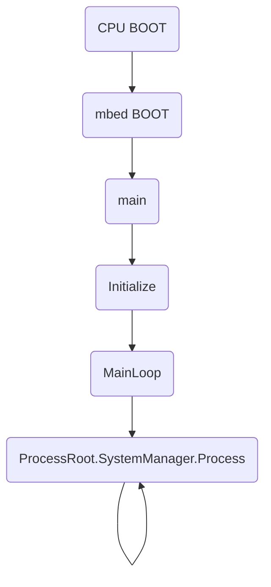

# BOOTプロセス

## ブート
通常のC/C++処理系と同様に、ブートアップ後はブートコードにより[main.cpp](../src/main.cpp)内のmain関数がコールされる。

## main()
main関数では、Initialize()関数で各種サブシステムの初期化を行ったあと、MainLoop()関数内で無限ループに入る。

すべてのプロセスは、ProcessRoot.SystemManager.Process()内から適切にコールされるため、通常、main.cppを変更する必要はない。

### Initalize()
必要なサブシステムの初期化を行う。

各サブシステムの詳細は、それぞれのドキュメントを参照すること。

####　LogSystem.Initialize()
ログシステムのインスタンス化及び個別の初期化を行い、ログシステムを稼働させる。
[LogSystem](../src/LogSystem.md)

#### DBCCommandRoot.Initialize()
デバッグシェルにデバッグコマンドを登録し、デバッグシステムを稼働させる。

デバッグコマンドを追加修正する場合は、[DBGCommandRoot.hpp](../src/debug_command/DBGCommandRoot.hpp)及び[DBGCommandRoot.cpp](../src/debug_command/DBGCommandRoot.cpp)を修正する必要がある。

#### CommandRootlInitialize()
コマンド(コマンドテレメトリ)の初期化を行う。コマンドを追加修正する場合は、[CommandRoot.hpp](../src/command/CommandRoot.hpp)及び[CommandRoot.cpp](../src/command/CommandRoot.cpp)を修正する必要がある。

#### StateRoot.Initialize()
ステートマシンの初期化を行う。ステートを追加修正する場合は、[StateRoot.hpp](../src/states/StateRoot.hpp)及び[StateRoot.cpp](../src/states/StateRoot.cpp)を修正する必要がある。

#### ProcessRoot.Initialize()
プロセスシステムの初期化を行う。[ProcessRoot.hpp](../src/processes/ProcessRoot.hpp)及び[ProcessRoot.cpp](../src/processes/ProcessRoot.cpp)を修正する必要がある。

### MainLoop()
ProcessRoot.SystemManager.Process()を繰り返しコールすることにより、OS02の動作を開始する。
