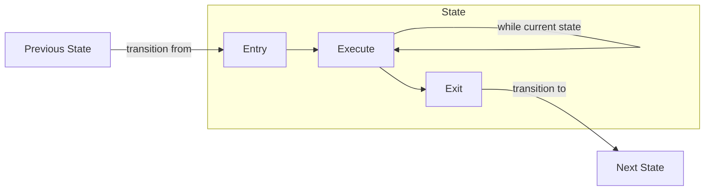
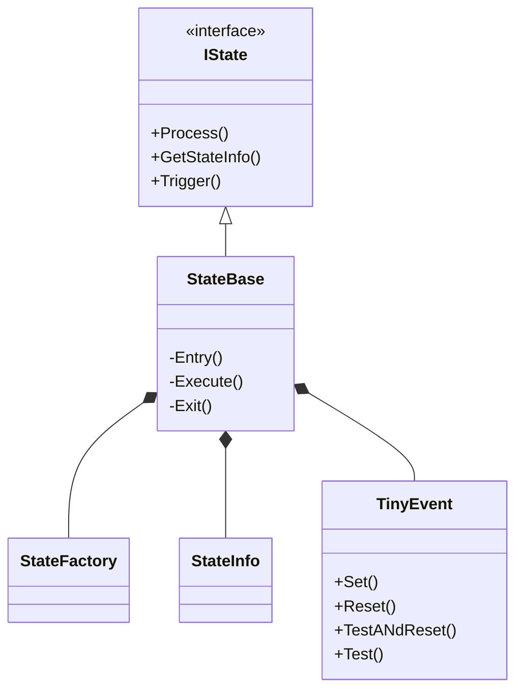

# fsm(Finite State Machine)

## はじめに
ごく一般的な有限状態マシンを簡易に実装できるようにすることを目的とした、クラスライブラリ。

具体的には、状態を表すクラスの3つのメソッド(Entry(),Execute(),Exit())を実装するだけで、どう動かさなければならないかの知識不要で適切に有限状態マシンを自動的に動作させることを目的としている。

## モデル
* 原則的に1状態を1クラスにマッピングする
	* 内部状態の実装に成約は設けない
* 状態モデルは、以下を採用する
	* Entry : 他状態から遷移してきた時に1度だけ呼ばれる処理
	* Execute : 状態にとどまっている限り連続して呼ばれる処理
	* Exit : 他状態に遷移しようとする時に1度だけ呼ばれる処理

## クラス図

### IState
状態を他の状態やシステムとの関連として抽象化したインターフェース。Trigger()は、後述のトリガシステムを使ってなんらかのイベントをトリガするためのメソッド。

### StateBase
有限状態マシンを成立させるための実装

内部的には、StrategyパターンでEntry(),Execute(),Exit()の適切なコールを行っている。

### StateFactory
StateIDから状態を表すクラスへのポインタを返すファクトリクラス。

### StateInfo
状態のステータスを表すクラス

| メンバ | 説明 |
----|----
const char* Name		| 状態の名前
const T ID				| 状態ID
StopWatch sw			| 状態に留まっている(いた)経過時間
long EnteringCount		| 別の状態からこの状態に遷移してきた類型回数
long ExitingCount		| この状態から別の状態に遷移した類型回数
EInnerState InnerState	| 現在のInnerState(Enter,Execute,Exit)
long ExecutingCount		| Processが呼ばれた類型回数
void* Optional			| これら以外の情報を引き渡すための拡張ポイント

これらの状態は、自動的に最新の状態に更新されるため、デバッグやテレメトリとして活用することができる。

### TinyEvent
簡易的なイベント通知機構
#### メソッド
##### void Set(size_t n)
nで指定するイベントをセットする
##### void Reset(size_t n)
nで指定するイベントをリセットする
##### bool TestAndReset(size_t n)
nで指定するイベントがセットされているかを返すが、セットされていたらそのイベントをリセットする

イベントを、なんらかの処理を1回だけ依頼するために利用する場合、このメソッドでTestするべきである。

##### bool Test(size_t n)
nで指定するイベントがセットされているかを返す。

イベントがセットされている間絶え間なく処理を依頼するために利用する場合は、このメソッドでTestすべきである。
