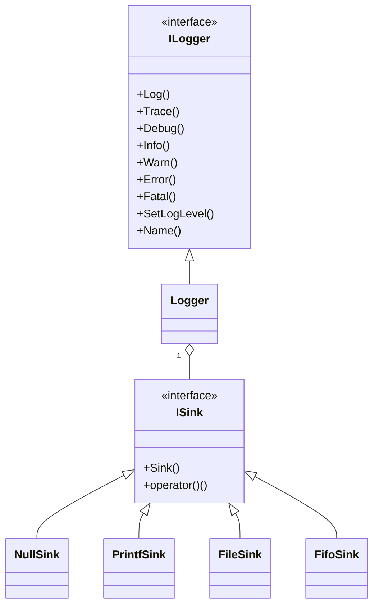

# logger(ログシステム)
## はじめに
### 背景
マイコン開発でのデバッグ手法として、printfデバッグは他のターゲットと同様にとても強力な手法であることに変わりはない。

しかし、マイコン環境では標準入出力が自明な形で提供されているとは限らず、また、提供されていたとしても、特定のUARTに固定的に接続されていたりして、必ずしも使い勝手が良いとは言えないことが多い。

また、開発者によって自由気ままにログを書き出すことは、ただでさえ解読が困難な非構造化ログをさらなるダークサイドへと誘ってしまう。

### 目的
本実装はログシステムとして、

* logger(ログAPI)と[sink(ログ生成)](sink.md)の分離
* タイムスタンプの自動付与
* LogLevelによるログ破棄
* 定型フォーマットでのログ生成

を最小限のAPIで実現することを目的としている

### アーキテクチャ
#### クラス図

ログAPI(ILogger)とログ生成(ISink)が完全に分離されているため、ILoggerのインスタンス化以降はアプリケーション層から具体的なログ生成機構を木にする必要はない。

### ILogger
アプリケーション層からは、このインターフェースを通してログシステムへのアクセスを行う。

具象クラスであるLoggerを直接アクセスすることもできるが、アプリケーション層から見たログシステムの本質はこのインターフェースだけなので、できるかぎり結合を疎に保つ方が良いことからも、インターフェース経由でのアクセスを推奨する。

#### API
##### void Log( ELogLevel ll, const char* fmt, ::va_list arg)
###### 動作
vprintf形式でフォーマットされたログを、ログレベルllで生成する
###### 引数
ELogLevel ll : 生成するログのログレベル
const char fmt : vprintfのフォーマット文字列
va_list arg : 可変長引数リスト

##### void Log( ELogLevel ll, const char* fmt, ...)
###### 動作
printf形式でフォーマットされたログを、ログレベルllで生成する
###### 引数
ELogLevel ll : 生成するログのログレベル
const char fmt : printfのフォーマット文字列
... : 可変長引数

##### void Trace(const char* fmt, ...)
###### 動作
printf形式でフォーマットされたログを、ログレベルTraceで生成する
###### 引数
ELogLevel ll : 生成するログのログレベル
const char fmt : printfのフォーマット文字列
... : 可変長引数

##### void Debug(const char* fmt, ...)
###### 動作
printf形式でフォーマットされたログを、ログレベルDebugで生成する
###### 引数
ELogLevel ll : 生成するログのログレベル
const char fmt : printfのフォーマット文字列
... : 可変長引数

##### void Info(const char* fmt, ...)
###### 動作
printf形式でフォーマットされたログを、ログレベルInfoで生成する
###### 引数
ELogLevel ll : 生成するログのログレベル
const char fmt : printfのフォーマット文字列
... : 可変長引数

##### void Warn(const char* fmt, ...)
###### 動作
printf形式でフォーマットされたログを、ログレベルWarnで生成する
###### 引数
ELogLevel ll : 生成するログのログレベル
const char fmt : printfのフォーマット文字列
... : 可変長引数

##### void Error(const char* fmt, ...)
###### 動作
printf形式でフォーマットされたログを、ログレベルErrorで生成する
###### 引数
ELogLevel ll : 生成するログのログレベル
const char fmt : printfのフォーマット文字列
... : 可変長引数

##### void Fatal(const char* fmt, ...)
###### 動作
printf形式でフォーマットされたログを、ログレベルFatalで生成する
###### 引数
ELogLevel ll : 生成するログのログレベル
const char fmt : printfのフォーマット文字列
... : 可変長引数

##### void SetLogLevel( ELogLevel lv)
###### 動作
ログ生成するLogLevelのしきい値をELogLevelで設定する

このしきい値より低いLogLevelのログは、破棄される

###### 引数
ELogLevel ll : 生成するログのログレベル

##### bool SetLogLevel( const char* lv)
###### 動作
ログ生成するLogLevelのしきい値を文字列で設定する

このしきい値より低いLogLevelのログは、破棄される

###### 引数
ELogLevel ll : 生成するログのログレベル

##### const char* Name() const
###### 動作
Logger生成時に設定したNameを返す
