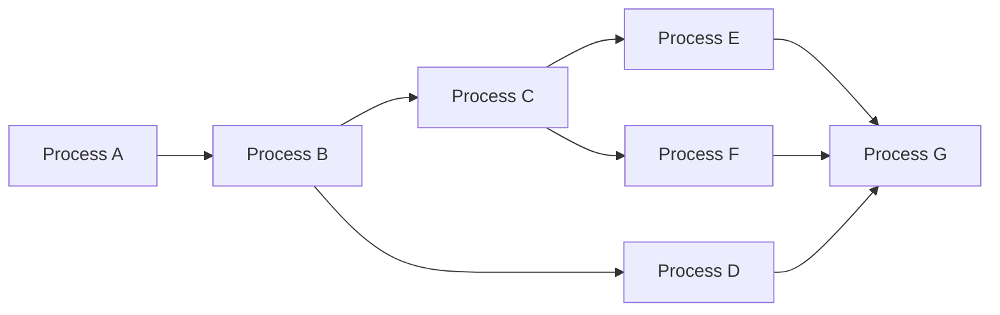
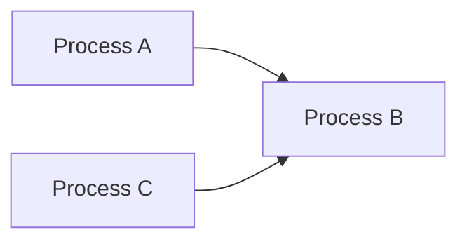
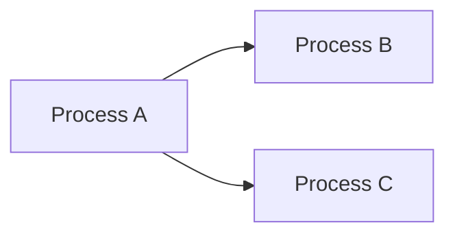
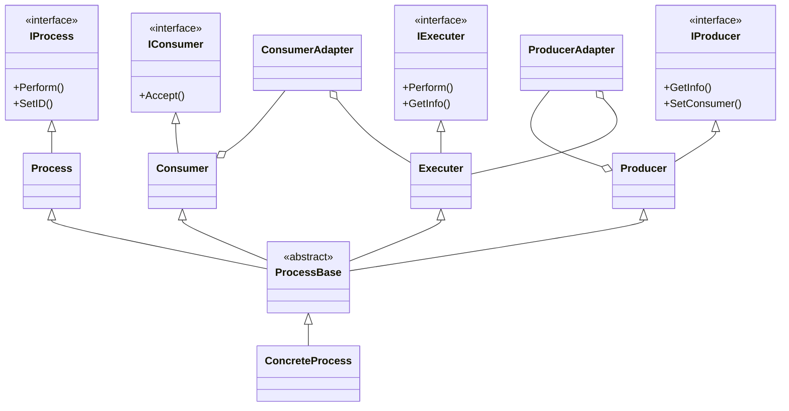

# Process
## はじめに
OS/02は、協調型マルチタスクベースのマルチタスク（OS/02では最小単位がプロセスなので、マルチプロセス）に、データフローの考えを取り入れたシステムになっている。

## アーキテクチャ
### プロセスモデル

OS/02のプロセスモデルは、複雑な処理を、簡単で単純な処理に分解してProcessAなどのプロセスとして定義し、その連鎖で実現できる実装を標榜している。

プロセス間のデータ受け渡しなどを考慮すれば、非効率な実装になるが、データ変換や、コマンド-レスポンスの実装は複雑化しやすい。また、設計とコードの乖離が問題になることが多いため、このようにデータフロー図として記述された設計書であれば、ほぼそのままコード化できることは、大きなアドバンテージとなる。

### プロセス連鎖
プロセス間のつながり（連鎖）は、それぞれのプロセスの後続プロセスを設定することで実現している。
#### 縦続(Series)

Process Aの後続プロセスをProcess Bと指定する
コード例
```
ProcessA.SetConsumer(ProcessB)
```

#### 結合(Join)

Process AとProcess A'の後続プロセスをProcess Bと指定する
```
ProcessA.SetConsumer(ProcessB);
ProcessC.SetConsumer(ProcessC);
```

#### 分岐(Fork)

Process Aの後続プロセスをProcess BとProcess Cと指定する
```
ProcessA.SetConsumer(ProcessB);
ProcessA.SetConsumer(ProcessC);
```
***(注)現バージョンのOS/02では、分岐をサポートしていない。MessageDispatcherは、OS/02のメッセージ通信機構を使わずに、分岐を実装している。***

### クラス図


#### IProcess
プロセス実行カーネルから見た抽象化されたプロセスを表すインターフェースであり、繰り返し呼び出されることにより、プロセス実行のエントリポイントとなるPerform(),プロセスIDを設定するためのSetID含まれる。
IProcess::Perform()は、内部的にIExecuter::Perform()に委譲される。

#### IExecuter
入力データを出力データへと変換する「処理」を抽象化したインターフェースであり、入力データを受け取った時に「処理」を実行するためのPerform()が含まれる。

#### IConsumer
プロセスをConsumer(データ受信機能)として抽象化したインターフェースであり、先行プロセスからデータを受信する（データを注入する）Accept()が含まれる

#### Producer
プロセスをProducer(データ送信機能)として抽象化したインターフェースであり、後続プロセスを指定するSetConsumer()が含まれる。

### プロセスモデル
#### プロセスの種類


OS/02のプロセスは、内部的にConsumer,Executer,Producerの3つの機能の組み合わせで実装されている。機能の組み合わせから、論理的に意味のある4種類のプロセスが型エイリアスとして定義されている。

| ProcessType | データ入力 | データ出力 | 処理 | Description |
----|----|----|----|----
| PipelineProcess   | ✓ | ✓ | ✓ | 入力データを処理し出力データを生成する |
| ConsumerProcess   | ✓ |    | ✓ | 入力データを処理する |
| ProducerProcess   |    | ✓ | ✓ | 出力データを生成する |
| IndivisualProcess |    |    | ✓ | 処理はするが、入力データも出力データも存在しない |

### プロセスの実装
プロセスを実装するために必要なことは、上記4類型のうちのひとつのプロセスを継承したクラスを実装することである。実際には、プロセス制御のためのコードはすべてProcessBaseより底に位置するクラス群に実装されているため、本当に必要なことは、Executer::ConcreteProcess()を実装することだけである。

1. 基底となるクラスを決める
	* 入力だけがあるプロセス→ConsumerProcess
	* 出力だけがあるプロセス→ProducerProcess
	* 入出力があるプロセス→PipelineProcess
	* 入力も出力もないプロセス→IndivisualProcess
  
1. 入力データと出力データの型を決める
	* 汎用的な型に対応するプロセスを実装する場合は、テンプレート型引数をそのまま残しておく
	* 決まった型に対応するプロセスを実装する場合は、テンプレートを特殊化する(「後述のプロセス実装の実演」を参照)

1. プロセスを表すクラスを定義する

	```
	template<typename CNS_T,typename PRD_T>
	class DemoClass : rsp::rsp02::system::PipelineProcess
	{

	};
	```
	typename CNS_T : 入力データの型(Consumer機能が受け入れる型)
	typename PRD_T : 出力データの型(Producer機能が生成する型)

1. bool ConcreteProcess()をオーバーライドする
	```
	template<typename CNS_T,typename PRD_T>
	class DemoClass : rsp::rsp02::system::PipelineProcess<CNS_T,PRD_T>
	{
		private:
			bool ConcreteProcess(CNS_T &product, PRD_T &reproduct)
			{
				プロセスの処理
			}
	};
	```
	ConcreteProcessの引数はそれぞれ、

	CNS_T &product : 入力データ
	PRD_T &reproduct : 出力データ

	であり、このConcreteProcess()は、入力データを受信したタイミングで1度だけ呼ばれることが保証されているため、入力データの到達チェックなどは不要。
	reproductに出力データを設定し、trueを返すと自動的に出力データを後続プロセスに送信する。

1. 必要に応じてコンストラクタなどを記述する
	入力データからだけでは出力データを決められない場合（恐らくこの場合の方が多いはず）は、コンストラクタやセッタを記述して、その情報を設定できるようにしなければならない。

### プロセス実装の実際
たとえば、入力データにある固定値を足して出力するプロセスを実装してみる

1. 基底となるクラスを決める
	入力データも出力データもあるプロセスなので、PipelineProcessを基底とする

1. 入力データと出力データの型を決める
	ここでは、int型のデータを入力しint型のデータを出力することにする
	```
	CNS_T → int
	PRD_T → int
	```
1. プロセスを表すクラスを定義する
	```
	namespace rsp::rsp02::system{
	class AddConstant : public rsp::rsp02::system::PipelineProcess<int,int>
	{

	}
	}
	```

1. bool ConcreteProcess()をオーバーライドする
	```
	namespace rsp::rsp02::system{
	class AddConstant : public rsp::rsp02::system::PipelineProcess<int,int>
	{
		private:
			int constant;
			bool ConcreteProcess(int product, int reproduct)
			{
				reproduct = product + constant;
				return true;
			}
	}
	}
	```
	productにconstantを足したものをreproductに設定し、trueを返す。

1. 必要に応じてコンストラクタなどを記述する

	今までの実装では、固定値constantはゼロにしかならないため、これを事前に変更できるようにする
	1. コンストラクタから設定を注入
	プロセス生成時に一度だけconstantを決めて、その後変更しないのであれば、コンストラクタで設定するようにする

	```
	namespace rsp::rsp02::system{
	class AddConstant : public rsp::rsp02::system::PipelineProcess<int,int>
	{
		public:
			AddConstant(int c):constant(c){}
		private:
			int constant;
			bool ConcreteProcess(int product, int reproduct)
			{
				reproduct = product + constant;
				return true;
			}
	}
	}
	```
	i.setterで設定を注入する
	プロセス起動中にもconstantを変更しなければならないのであれば、setterを用意する
	```
	namespace rsp::rsp02::system{
	class AddConstant : public rsp::rsp02::system::PipelineProcess<int,int>
	{
		public:
			AddConstant(int c):constant(c){}
			SetConstant(int c){constant=c;}
		private:
			int constant;
			bool ConcreteProcess(int product, int reproduct)
			{
				reproduct = product + constant;
				return true;
			}
	}
	}
	```
#### プロセスの登録
今実装したプロセスを、OS/02に登録するとOS/02から適切に呼ばれ、このプロセスを実行することができるようになる。
現在の実装では、[ProcessRoot.cpp](../../../src/processes/ProcessRoot.cpp)と[ProcessRoot.hpp](../../../src/processes/ProcessRoot.hpp)を書き換える必要がある。

1. ProcessRoot.hppに今実装したプロセスのヘッダをインクルードする
	```
	#include "AddConstant.hpp"
	```
	を追加

1. ProvessRoot.hppに今実装したプロセスのインスタンスを追加
	```
	rsp::rsp02::system::AddConstant addConst(0);
	```
	を追加
1. ProcessRoot.cppのInitialize()にプロセス登録のコードを追加
	```
	SystemManager.RegisterProcess( &addConst);
	addConst.SetConsumer( /*後続のプロセスを指定*/)
	```
上記3ステップでプロセスの登録が完了する。
